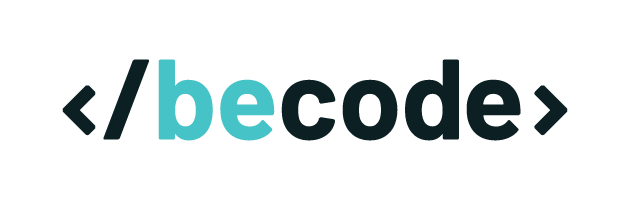

<h2 align="center"> Portfolio forecasting & optimization project </h2>
<p align="center"><a href="https://github.com/AnhSN/becode-financial_engineering_intro.git">
</a></p>

<h3 align="center">Introduction to financial engineering made during <a href="https://github.com/becodeorg">BeCode</a> training.</h3><br><br>

## Description

As part of my training as a data engineer at BeCode, I was assigned to scrape and store data from [Yahoo finance](https://finance.yahoo.com) in order to get an introduction at financial engineering.

The project is divided in 3 folders:

1. data_collect: access to [Yahoo finance](https://finance.yahoo.com) and scrape the required data
2. database: export the data previously collected into a database
3. assets: contains all of my .csv files and image

## Installation

1. Clone the repo.
2. Install all the required libraries using

   ```
   pip install requirements.txt
   ```

   * beautifulsoup4 4.12.0
   * pandas 1.5.3
   * requests 2.28.2
   * selenium 4.8.2
   * SQLAlchemy 2.0.7

## Usage

#### data_collect (folder)

This folder is currently composed of two files. For a real deployment, only scraper.py would be left available but since those two files still need to be merged, I chose to let both of them for now.

##### getstockprices-bs.py

Using [Florent Maisse](https://github.com/Flotchet) [list of ticker symbols](https://github.com/Flotchet/All-tickers-around-the-world), it accesses the [Yahoo finance](https://finance.yahoo.com) quote page of the listed symbols using requests. Then, using BeautifulSoup, it finds the current price and change of each page and store these informations into a list of dictionaries.

##### scraper.py

Unlike *getstockprices-bs.py*, right now *scraper.py* only scrapes data from a single page.

It accesses the history page, get rid of the cookies popup and the sign in popup then retrieves the data contained in each cell of the HTML table using selenium. The data is stored into a dataframe thanks to a loop inside the table and at the end, the dataframe is converted to a .csv file for later use.

#### database (folder)

##### df_to_sql.py

Establish a connection to a sqlite database and use it to store the data collected by *scraper.py*. Taking a .csv file as an input, transforming it to a dataframe then converting the dataframe to a database.

#### assets (folder)

As mentionned above, this folder is a clean way to store the files used to make this project.

It contains the .csv files used in this project as well as the illustration of the README.

## Results

I successfully managed to extract data from [Yahoo finance](https://finance.yahoo.com) and store it into a database using selenium, pandas and sqlalchemy.

Using pandas, BeautifulSoup and requests, I collected the current price and change about several ticker symbols. The first improvement which should be made would be to combine both scrapers so it would collect the history data of more stocks.

I've also tried to implement a DAG and docker but unfortunately, due to a problem with my docker-compose, I wasn't able to do so in the given time. This would have allowed the program to automatically update our dataset.

## Contact

project made by [Anh Sophie Noël](https://www.linkedin.com/in/anhsn-vision/).
